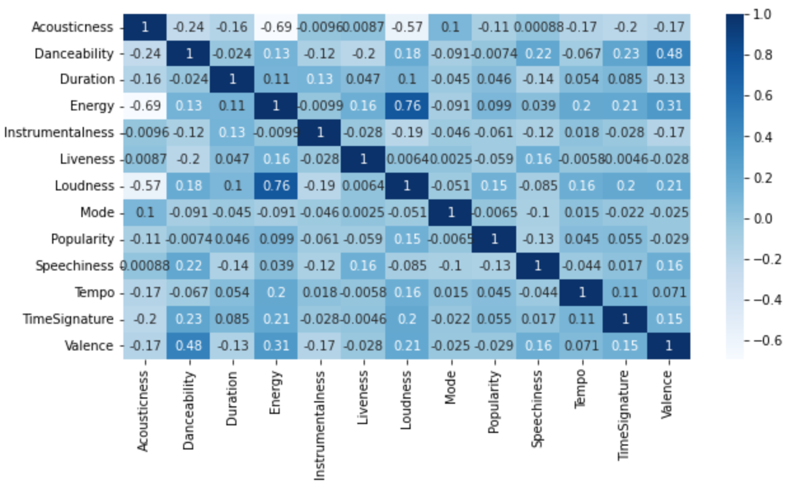
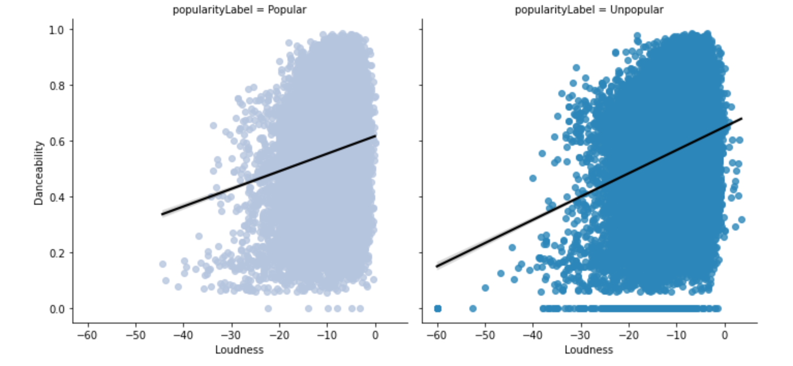

# KDD Group 14 Project
This project is part of the Knowledge Discovery in Databases (DSBA 6162) course from University of North Carolina at Charlotte.

## Team Members
- Vathsavi Venkat
- Yash Patel
- Zubin Ladwa

## Introduction to Problem or Opportunity
Music is all around us and plays a key part in today’s culture. Popularity in music is always hard to determine. It is unpredictable determining which song is going to be a hit. Music popularity also plays a crucial role in establishing if the song is going to be a Grammy award winner. There are different perspectives we need to take into consideration such as how music taste changes during a pandemic, or how seasonality affects it. We will look at the popularity of music based on the song’s attributes.

## Research Question
Given the past 20 years of data, we want to determine what effect song attributes (Danceability, Energy, Tempo, etc.) have on the popularity of a song that has been obtained from the US population. Can the song attributes predict whether it will be a Grammy award winner?

## Data Resources
We have obtained the dataset from Kaggle. This dataset contains song attributes, popularity, Grammy award-winning songs, and other aspects. The datasets can be found here: [Datasets](https://github.com/yashapatel131/KDD_GroupProject/blob/main/Datasets)

## Data Preprocessing
Preprocessing is used at the beginning stages to prepare the data for evolution and modeling. The SongAttributes dataset did not have any missing values, due to which we did not have to deal with the issue of missing data. A new column called popularityLabel was created. This column was calculated based on the Popularity rating. If the popularity value of the song was greater than 20 then the song was given the label of 'Popular' and if less than 20 then, the value was given the label of 'Unpopular.' The new CSV file that was created can be found here: [Song_Atrributes.csv](https://github.com/yashapatel131/KDD_GroupProject/blob/main/Datasets/Song_Attributes.csv)

## Data Understanding and Exploration
There are different types of music, which leads to variation in the attributes that compose each song. Through the use of visualizations, the underlying trends within the data were presented. By using different types of charts, we were able to see the data in a visual state. The use of these visualizations was an important aspect in seeing the trends. A few of the charts that were created were:

The correlation between two attributes:

The effect that attributes had on the target variable:

The overall comparison of all the attributes:

A more detailed analysis can be seen by visiting the link: [EDA and Data Preparation](https://github.com/yashapatel131/KDD_GroupProject/blob/main/EDA_and_DataPrep.ipynb)
